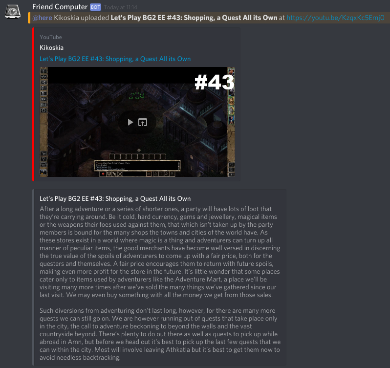

# Webhook processor for IFTTT YouTube integration

**Goal:** allow posting YouTube videos with descriptions to Discord webhooks.

**Initial approach:** IFTTT recipe to post directly to a Discord webhook endpoint.

**Problem:** Some descriptions are too long for the Discord message limit.

**Solution:** Provide a wehbook relay "proxy" that splits the data into several Discord messages.



## Installation

1. Create a non-porivileged user for running this. DO NOT RUN AS ROOT.

1. Install packages as per `requirements.txt` (using python3) as that user.

    ```bash
    pip3 install --user -r requirements.txt
    ```

2. Copy [`samples/config.example.json`](samples/config.example.json) as `config.json`. Fill out the fields:

    * `discordWebhookURL` is the Discord webhook endpoint to POST data to.
    * `authKey` is an arbitrary string that must be present in POST requests.
    * `port` is the TCP port to listen for IFTTT requests.
    * `host` is the hostname / IP to bind to. Set as `""` to listen on all interfaces.
    * `filters` is an array of (escaped) regular expressions to drop certain paragraphs from descriptions.

3. (Optional) Set up a "real" webserver as reverse proxy.

    Nginx config example:

    ```nginx
    location /hook {
      proxy_pass http://127.0.0.1:8000/;
    }
    ```

4. (Optional) Set up a systemd service unit.

    * Adapt values in [`samples/friend-computer-webhook.service`](samples/friend-computer-webhook.service) to real user/path
    * Copy to `/etc/systemd/system/`
    * Run `sudo systemctl daemon-reload`
    * Test service with `sudo systemctl start friend-computer-webhook` and `sudo systemctl status friend-computer-webhook`
    * Enable service with `sudo systemctl enable friend-computer-webhook` to survive reboot

## IFTTT setup

1. If not owner of the YouTube channel in question, make sure your YouTube account is subscribed to that channel.
2. Create an [IFTTT](https://ifttt.com/) account and [connect YouTube](https://ifttt.com/services/youtube/settings) integration with the above account.
3. [Create a new applet](https://ifttt.com/create):
    * Service: **YouTube**
    * Trigger:
        * For own channel: **New public video uploaded by you**
        * For third-party channel: **New public video from subscriptions**
    * Action service: **Webhooks**
    * Action: **Make a web request**
4. Fill out action fields:
    * URL: Provide an **internet-reachable URL** to the webhook relay
    * Method: **POST**
    * Content Type: **application/json**
    * Body (note the `<<<>>>` escapes!):
        ```json
        {
          "author": "<<<{{AuthorName}}>>>",
          "title": "<<<{{Title}}>>>",
          "url": "<<<{{Url}}>>>",
          "description": "<<<{{Description}}>>>",
          "authKey": "authKey set up in config.json"
        }
        ```
